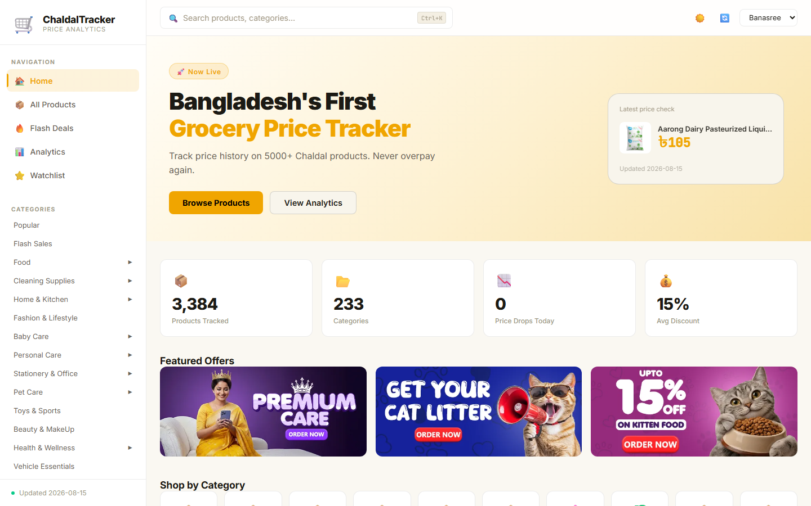
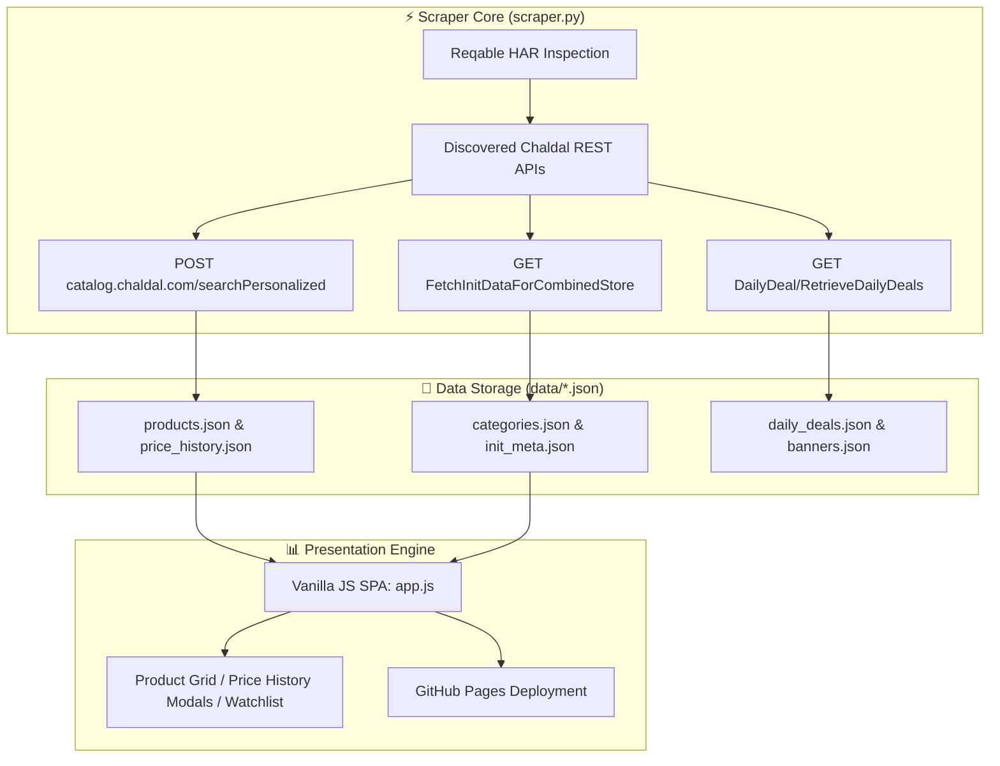

# 🛒 ChaldalTracker — Grocery Price Analytics Platform

> **Bangladesh's Premier Online Grocery Price Tracker & Market Forensics Engine for Chaldal.**

[](https://ranehal.github.io/CHALdal-analytics/)
[](https://github.com/ranehal/CHALdal-analytics/actions)
[-3776AB?style=for-the-badge&logo=python&logoColor=white)](https://www.python.org/)
[](LICENSE)

---

## 📌 Executive Summary

**ChaldalTracker** is a high-performance price tracking, discount analytics, and market monitoring platform tailored for [Chaldal](https://chaldal.com), Bangladesh's largest online grocery service.

Operating similarly to CamelCamelCamel for Amazon, ChaldalTracker captures daily snapshots of over 3,000+ products across 233 categories, tracks price volatility, detects flash sale deals, and displays real-time price trend charts through a responsive web application hosted on GitHub Pages.

---

## 🚀 Key Features

- **📊 Interactive Price History (Chart.js)**: Visualize product price changes over 7-day, 30-day, and all-time windows with historical minimum/maximum price indicators.
- **⚡ Reverse-Engineered Android API Engine**: Leverages mobile endpoints discovered via Reqable HAR traffic inspection of `com.chaldal.poached` (v10.5.3).
- **🏷️ Flash Sale & Deal Intelligence Engine**: Identifies daily deals and discounts, sorting items by absolute savings (৳) and discount percentage.
- **🌳 233-Category Tree Navigation**: Full multi-tier category navigation supporting instant fuzzy autocomplete search.
- **🔄 Automated GitHub Actions Pipeline**: Runs daily at midnight BST (`00:00 BST`) to ingest current market prices, commit delta JSON data, and update GitHub Pages.

---

## 📸 Screenshots

> Captured from a live localhost run of the dashboard.

| Dashboard |
| :---: |
|  |

---

## 🏗️ System Architecture



---

## 🔑 Reverse-Engineered API Specification

Ingestion connects directly to Chaldal's production API endpoints:

| Endpoint | HTTP Method | Description & Parameters |
| :--- | :--- | :--- |
| `eggyolk.chaldal.com/api-v4/Device/FetchInitDataForCombinedStore` | `GET` | Catalog categories, metropolitan areas, store constants |
| `catalog.chaldal.com/searchPersonalized` | `POST` | Category product listings & price details |
| `eggyolk.chaldal.com/api-v4/DailyDeal/RetrieveDailyDeals` | `GET` | Flash sales & daily promotional deals |

### Key API Payload Parameters
- `apiKey`: `e964fc2d51064efa97e94db7c64bf3d044279d4ed0ad4bdd9dce89fecc9156f0`
- `storeId`: `1` (Chaldal Main Store)
- `warehouseId`: `8` (Banasree Warehouse - Metro Dhaka Region)
- `metropolitanAreaId`: `1`

---

## 📁 Repository Structure

```
CHALDAL/
├── scraper.py              # Zero-dependency Python CLI scraper (urllib, standard library)
├── app.js                  # Vanilla JS SPA logic (Chart.js rendering, search, watchlist)
├── index.html              # Responsive single-page application markup
├── styles.css              # Dark/Light mode tokens & responsive UI styling
├── runall.bat              # Windows batch launcher (Scraper / Dashboard / Both)
├── data/                   # Generated JSON datasets
│   ├── products.json       # Product metadata lookup map
│   ├── categories.json     # Category tree structure
│   ├── price_history.json  # Time-series price logs per product ID
│   ├── daily_deals.json    # Active daily deals & discounts
│   └── init_meta.json      # Store metadata & shipping configuration
└── .github/workflows/
    └── scrape.yml          # GitHub Actions daily automated cron pipeline
```

---

## 🛠️ Usage & Local Setup

### 1. Interactive Windows Launcher
Execute [`runall.bat`](file:///C:/PROJECTS/CHALDAL/runall.bat) in command prompt:
```cmd
runall.bat
```
Interactive options:
- `[1] scraper` — Execute python scraper to refresh product JSON files.
- `[2] dashbrd` — Launch local HTTP server (`http://localhost:8000`).
- `[3] both` — Scrape fresh prices, then launch the dashboard.

### 2. Command Line Execution
```bash
# Run full store catalog scrape
python scraper.py

# Scrape specific category ID (for testing)
python scraper.py --cat 108

# Specify custom warehouse or area
python scraper.py --store 1 --warehouse 8 --area 4

# Start local dev web server
python -m http.server 8000
```

---

## 🚀 Future Work & Industrial Roadmap

To elevate this platform to an enterprise-grade, production-ready product meeting current industrial standards, the following strategic goals and architecture enhancements are planned:

### 1. 🏗️ High-Availability Microservices & Infrastructure
- **Containerization & Orchestration**: Package ingestion workers, APIs, and dashboards into Docker containers with deployment via **Kubernetes (K8s)** and Helm charts for autoscaling during peak traffic hours.
- **Distributed Ingestion Workers**: Transition from localized scraping scripts to an asynchronous, fault-tolerant worker pool utilizing **Celery + Redis** or **Temporal.io** with automated proxy rotation, rate-limiting retry strategies, and CAPTCHA bypass capabilities.
- **High-Performance API Gateway**: Implement an enterprise API Gateway (Kong / Envoy) providing OAuth2 / JWT authentication, TLS termination, and granular rate limiting (Token Bucket algorithm).

### 2. 📊 Enterprise Data Engineering & Streaming Pipelines
- **Data Lakehouse Architecture**: Store multi-year raw price histories using **Apache Parquet / Delta Lake** or **Google BigQuery** for scalable analytical queries across millions of SKU updates.
- **Real-Time CDC & Message Streaming**: Integrate **Apache Kafka** or **NATS** for Change Data Capture (CDC) to stream price change events instantly to downstream analytics and notification consumers.
- **Automated Workflow Orchestration**: Schedule and monitor data ingestion, ETL pipelines, and unit normalization using **Apache Airflow** or **Prefect** integrated with **dbt** for dynamic data transformations.

### 3. 🧠 Machine Learning & Advanced Market Intelligence
- **Predictive Price Forecasting**: Deploy **Prophet** and **LSTM Neural Networks** to predict future price drops, historical promotion trends, and seasonal discount cycles.
- **Anomaly & Surge Detection**: Build ML models to identify artificial price hikes before promotional sales, mislabeled unit metrics, and phantom stock availability.
- **Semantic Product Entity Matching**: Utilize vector embeddings (OpenAI / Sentence-Transformers) paired with **pgvector** / **Pinecone** to match identical SKUs across competitor platforms despite variations in naming formats.

### 4. 🔐 Security, Compliance & System Observability
- **Zero-Trust Security & RBAC**: Enforce Role-Based Access Control (RBAC), AES-256 GCM payload encryption at rest, and secret rotation via HashiCorp Vault.
- **Full Observability Stack**: Instrument services with **OpenTelemetry**, emitting distributed traces, Prometheus metrics, and structured logs to **Grafana Loki & Tempo** dashboards.
- **SLA Alerting & Webhook Engine**: Provide instant trigger notifications via **Telegram Bot API**, **Discord Webhooks**, email notifications, and enterprise SMS gateways when watched items reach target prices.

### 5. 📱 Next-Gen User Experience & Mobile Platforms
- **Cross-Platform Mobile App**: Develop a dedicated **React Native / Flutter** app featuring push notifications for price drops, barcode scanning in physical stores, and personalized deal watchlists.
- **Progressive Web App (PWA)**: Upgrade the dashboard to a full PWA with offline caching via Service Workers, dynamic theme switching, and desktop application installability.
### 1. Architecture & Infrastructure
- **Containerization & Orchestration**: Package scraper + dashboard as Docker images; deploy with `docker-compose` locally and Kubernetes (EKS/GKE) for horizontal scaling.
- **Managed Databases**: Migrate from file-based JSON + SQLite to a managed PostgreSQL (RDS/Cloud SQL) with partitioning for daily price snapshots and connection pooling (PgBouncer).
- **Broker-Backed Ingestion**: Replace in-process scraping with a resilient pipeline using Redis Streams / Kafka with retries, dead-letter queues, and resumable checkpoints.
- **Object Storage + CDN**: Store raw daily snapshots in S3/Cloudflare R2 with a CDN for static assets; enforce lifecycle policies for archival.
- **Caching Layer**: Redis for hot queries (stats, categories, recent products) with TTL invalidation; ETag/If-Modified-Since on all API responses.

### 2. Reliability & Observability
- **Structured Logging & Tracing**: JSON structured logging with correlated request IDs and OpenTelemetry tracing across scraper → queue → DB → API.
- **Metrics & Alerting**: Prometheus metrics (scrape success rate, latency percentiles, job durations) + Grafana dashboards + PagerDuty/AlertManager alerts.
- **SLOs & Health Checks**: `/health`, `/ready` endpoints; scraper watchdog that auto-recovers from stuck sessions; idempotent job resumption.
- **Automated Testing**: Unit tests for API parsing and delta compression; integration tests with recorded fixtures; end-to-end Playwright tests for the dashboard.

### 3. Security & Compliance
- **Secret Management**: Move all credentials into a vault (AWS Secrets Manager / HashiCorp Vault / Doppler) — never baked into images or repos.
- **Auth & Rate Limiting**: API-key/JWT-based access control with per-tenant rate limiting; TLS everywhere; dependency scanning (Snyk/Dependabot) and SBOM generation.
- **Respectful Crawling**: robots.txt compliance, domain-wide polite rate limiting, exponential backoff, and traffic shaping to avoid impacting the upstream service.

### 4. Data Platform & Analytics
- **Warehouse & BI**: Land normalized datasets into a columnar warehouse (ClickHouse/BigQuery) with dbt transformations; build Looker/Metabase dashboards.
- **Streaming Prices**: Migrate daily batch snapshots to near-real-time streaming (Kafka → Flink/Spark) for live price movement detection.
- **ML / Forecasting**: Add time-series forecasting (Prophet/ARIMA/LightGBM) for price prediction, anomaly detection on drops, and personalized deal recommendations.

### 5. Product & UX
- **User Accounts & Sync**: OAuth2 accounts, cross-device watchlists/alerts, and email/push notifications (SendGrid/FCM) when target prices are hit.
- **Public API & Docs**: Versioned, documented public REST API (OpenAPI) with rate limits and developer keys; optional GraphQL gateway.
- **Localization & Accessibility**: Full i18n (bn/en), WCAG 2.1 AA compliance, dark/light theming consistency, and mobile-first responsive PWA with offline mode.
- **Performance Budget**: Code-splitting, virtualized product lists, lazy-loaded charts, and Lighthouse budgets enforced in CI (CLS < 0.1, LCP < 2.5s).

---

## 📜 License

Distributed under the MIT License. Data rights belong to Chaldal. Constructed for analytical and educational purposes.
