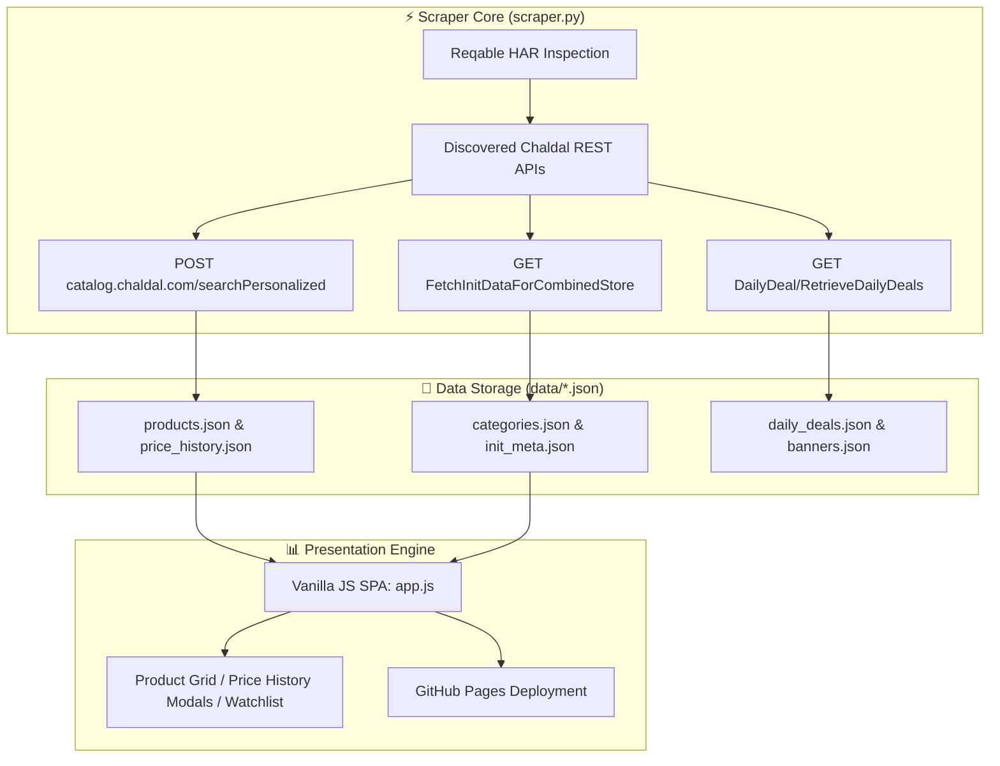

# 🛒 ChaldalTracker — Grocery Price Analytics Platform

> **Bangladesh's Premier Online Grocery Price Tracker & Market Forensics Engine for Chaldal.**

[](https://ranehal.github.io/CHALdal-analytics/)
[](https://github.com/ranehal/CHALdal-analytics/actions)
[-3776AB?style=for-the-badge&logo=python&logoColor=white)](https://www.python.org/)
[](LICENSE)

---

## 📌 Executive Summary

**ChaldalTracker** is a high-performance price tracking, discount analytics, and market monitoring platform tailored for [Chaldal](https://chaldal.com), Bangladesh's largest online grocery service.

Operating similarly to CamelCamelCamel for Amazon, ChaldalTracker captures daily snapshots of over 3,000+ products across 233 categories, tracks price volatility, detects flash sale deals, and displays real-time price trend charts through a responsive web application hosted on GitHub Pages.

---

## 🚀 Key Features

- **📊 Interactive Price History (Chart.js)**: Visualize product price changes over 7-day, 30-day, and all-time windows with historical minimum/maximum price indicators.
- **⚡ Reverse-Engineered Android API Engine**: Leverages mobile endpoints discovered via Reqable HAR traffic inspection of `com.chaldal.poached` (v10.5.3).
- **🏷️ Flash Sale & Deal Intelligence Engine**: Identifies daily deals and discounts, sorting items by absolute savings (৳) and discount percentage.
- **🌳 233-Category Tree Navigation**: Full multi-tier category navigation supporting instant fuzzy autocomplete search.
- **🔄 Automated GitHub Actions Pipeline**: Runs daily at midnight BST (`00:00 BST`) to ingest current market prices, commit delta JSON data, and update GitHub Pages.

---

## 🏗️ System Architecture



---

## 🔑 Reverse-Engineered API Specification

Ingestion connects directly to Chaldal's production API endpoints:

| Endpoint | HTTP Method | Description & Parameters |
| :--- | :--- | :--- |
| `eggyolk.chaldal.com/api-v4/Device/FetchInitDataForCombinedStore` | `GET` | Catalog categories, metropolitan areas, store constants |
| `catalog.chaldal.com/searchPersonalized` | `POST` | Category product listings & price details |
| `eggyolk.chaldal.com/api-v4/DailyDeal/RetrieveDailyDeals` | `GET` | Flash sales & daily promotional deals |

### Key API Payload Parameters
- `apiKey`: `e964fc2d51064efa97e94db7c64bf3d044279d4ed0ad4bdd9dce89fecc9156f0`
- `storeId`: `1` (Chaldal Main Store)
- `warehouseId`: `8` (Banasree Warehouse - Metro Dhaka Region)
- `metropolitanAreaId`: `1`

---

## 📁 Repository Structure

```
CHALDAL/
├── scraper.py              # Zero-dependency Python CLI scraper (urllib, standard library)
├── app.js                  # Vanilla JS SPA logic (Chart.js rendering, search, watchlist)
├── index.html              # Responsive single-page application markup
├── styles.css              # Dark/Light mode tokens & responsive UI styling
├── runall.bat              # Windows batch launcher (Scraper / Dashboard / Both)
├── data/                   # Generated JSON datasets
│   ├── products.json       # Product metadata lookup map
│   ├── categories.json     # Category tree structure
│   ├── price_history.json  # Time-series price logs per product ID
│   ├── daily_deals.json    # Active daily deals & discounts
│   └── init_meta.json      # Store metadata & shipping configuration
└── .github/workflows/
    └── scrape.yml          # GitHub Actions daily automated cron pipeline
```

---

## 🛠️ Usage & Local Setup

### 1. Interactive Windows Launcher
Execute [`runall.bat`](file:///C:/PROJECTS/CHALDAL/runall.bat) in command prompt:
```cmd
runall.bat
```
Interactive options:
- `[1] scraper` — Execute python scraper to refresh product JSON files.
- `[2] dashbrd` — Launch local HTTP server (`http://localhost:8000`).
- `[3] both` — Scrape fresh prices, then launch the dashboard.

### 2. Command Line Execution
```bash
# Run full store catalog scrape
python scraper.py

# Scrape specific category ID (for testing)
python scraper.py --cat 108

# Specify custom warehouse or area
python scraper.py --store 1 --warehouse 8 --area 4

# Start local dev web server
python -m http.server 8000
```

---

## 📜 License

Distributed under the MIT License. Data rights belong to Chaldal. Constructed for analytical and educational purposes.
